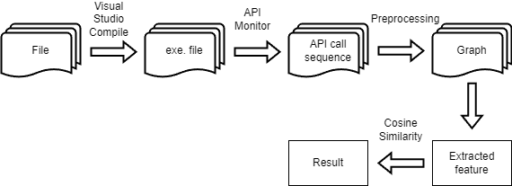

# API Call Work

## Requirement
* Python package : networkx 2.6.3
* API Monitor
* Visual Studio
* Windows Vitural Machine
---
## Introduce
* Compile the data by visual studio on virtual machine

[Data](https://github.com/aaaddress1/my-Little-Ransomware/)
* Acquire the API call funciton from .exe file by API Monitor
* Transform the API call sequence to graph
* Extract the feature in graph
* Compute the similarity of two graph by cosine similarity
* Framework

---
## File
* decrypt.pkl ransomware.pkl : the graph created by the file
* decrypt.txt ransomware.txt : API call of the file
* API_graph.ipynb : the source code of the whole work
---
## Result
* Cosine Similarity: 0.9990533007920036

